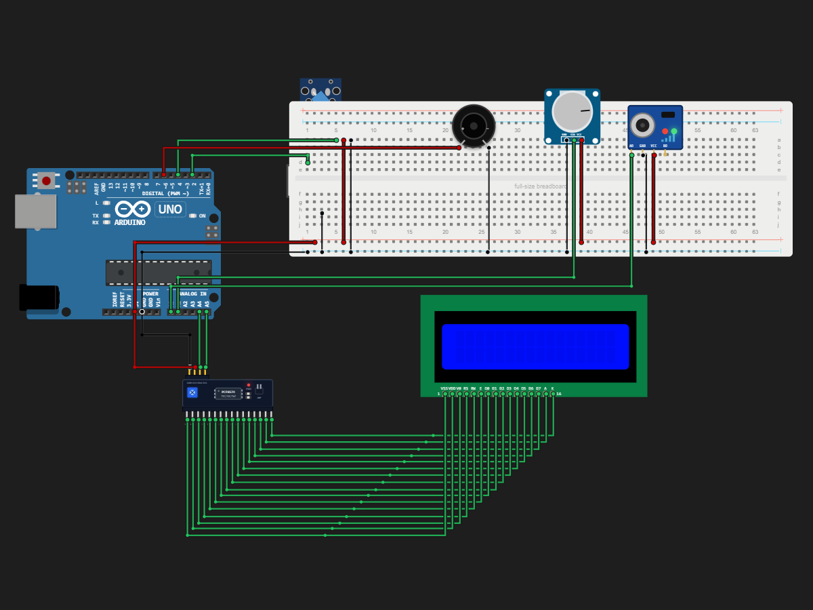

# Alarm System

> Built in [Breadboard](https://breadboard.hackclub.com), a Hack Club program. This project took ~5 hours of work.

## What It Does

An alarm system using arduino uno
Use tactile button to arm or disarm system
Use potentiometer to adjust sensitivity of mic, CW = more sensitive, ACW= less sensitive
When armed, if noise detected over certain level or if vibration detected, alarm will sound and will be displayed on lcd too
Use tactile button to stop alarm

## How It Works

The circuit is captured in `breadboard-project.json`, and the firmware that runs it is in the `firmware/` folder.

## How To Use It

- Use tactile button to arm or disarm system
- Use potentiometer to adjust sensitivity of mic, CW = more sensitive, ACW= less sensitive
- When armed, if noise detected over certain level or if vibration detected, alarm will sound and will be displayed on lcd too
- Use tactile button to stop alarm

## Demo

- **Simulate it live:** [https://breadboard.hackclub.com/share/123](https://breadboard.hackclub.com/share/123), runs the firmware in the Breadboard simulator
- **View the design:** [https://taniwankenobi.github.io/breadboard-plays/p/123/](https://taniwankenobi.github.io/breadboard-plays/p/123/)

## Schematic

The editor snapshot is in `breadboard-project.json`.

## Bill of Materials

| Part | Quantity |
| --- | --- |
| breadboard-full | 1 |
| buzzer-active | 1 |
| lcd1602 | 1 |
| lcd1602-i2c | 1 |
| microphone-module | 1 |
| potentiometer | 1 |
| pushbutton | 1 |
| vibration-switch | 1 |

## Firmware

Firmware files are in the `firmware/` folder.

## Build Journal

Build journal entries are kept in [`journals.md`](journals.md).

---

*Made in [Breadboard](https://breadboard.hackclub.com) — 5h of work*

